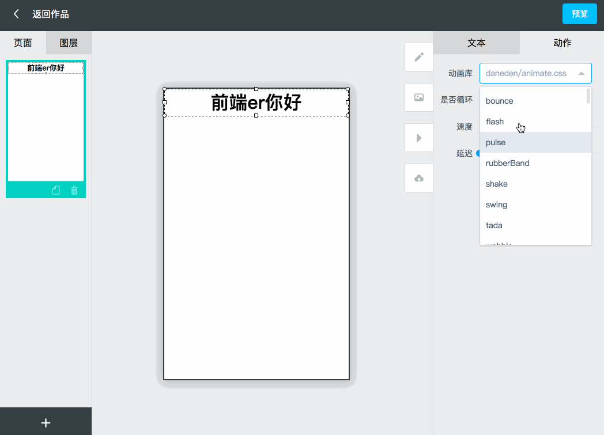

## h5在线编辑平台

forked from h5maker

update and fix bug

### 技术架构
> 前端：vue2.0 + vue-router + vuex + axios + Element ui

> 后端：nodejs + express + mongoose

### 演示效果


### 注意！！！
运行前需要先启动mongodb数据库，请确保本地已安装数据库

### 运行方法
> npm install  // 安装依赖

> npm run webapp // 启动前端工程

> npm run local //  启动后端工程

### 使用文档 （部署项目有关）

部署地址：http://vip.yypm.com/h5docMaker/index.html#/login

webhooks地址：http://172.27.142.9:9696

发布之后会提示发布成功，此时并不是已经上线，只是建立同步代码至SVN的异步任务成功。

进入webhooks地址，一段时间后会提示，此时代表异步任务成功

```
webhooks auto deploy success!
branch: master
namespace：bilin/bilin-static-tpl
email：xxxxxx@yy.com
```

点击webhooks上的发布按钮，然后发布项目Key是bilinStaticTpl的项目，输入潜龙发布的用户名和密码。点击发布，大约两分钟左右会看到上线结果。

```
bigdragon auto deploy success!
user: xxxxxx
name：bilin_tpl_front
alias：比邻前端静态页面
env：prod
```

上线成功就可以看上线地址上的内容了
